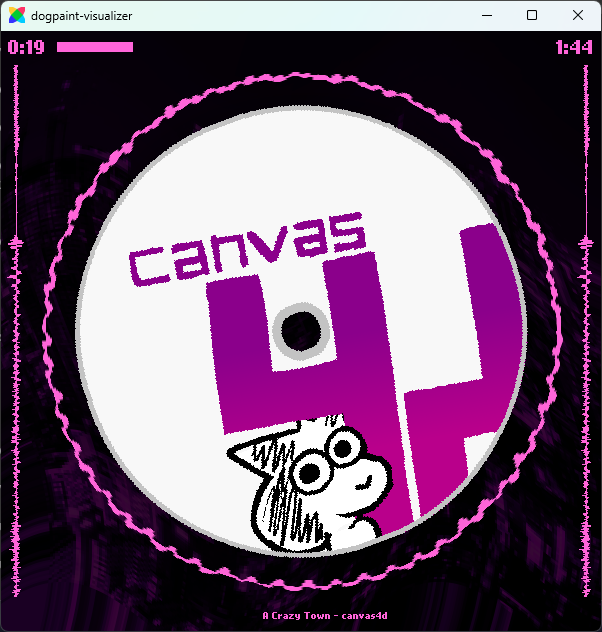

# dogpaint-visualizer

A music visualizer created for [canvas4d](https://www.youtube.com/watch?v=iqknD7Vse_Y), a song I made for another one of my Flixel projects... coming soon?(don't quote me on that).
This isn't really intended for public use, but I'm releasing it cus why not :D

This code is a hot steaming mess held together with hopes, dreams and duct tape. You have been warned.

You are free to adapt this for your own purpose but please credit me/this project. Also note that the assets provided here are not free use and are [licensed differently](assets/README.md).

## Installation

1. Install [hmm](https://github.com/andywhite37/hmm#installing-hmm)

2. Install dependencies by running `hmm install`

3. Compile like any other HaxeFlixel project by running `lime test <target>`
    - I personally used Hashlink. I believe HTML5 will not work due to a limitation with the waveform renderer, but other native targets should be fine.
